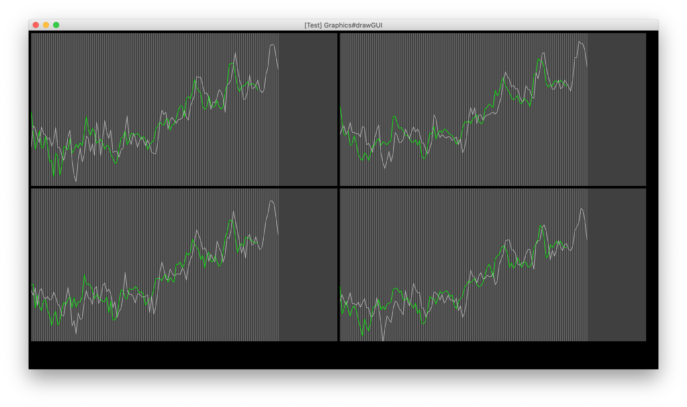

# StockNNet

## Overview
This is my mini project where I used neural networks and the yahoofinance library to generate short term predictions (5-10 days) of day-to-day stock data.

## "Technical" Details
* Input vector consists of opening, closing, min and max price of multiple days.
* The calibration algorithm automatically picks the network depth and the input size that minimises total errors after testing a few different models.
* The period of data to train with is also automatically selected based on the total error.
* Once trained, it shows 5-10 days of predicted future data for opening, closing, max and min values.

## Why It Doesn't Work Well
* It was just a quick test for fun.
* Lack of well designed pre-processing layers.
* And overfitting issues caused by it.
* Not enough input data (e.g., real-life news somehow processed into numerics, etc.?)